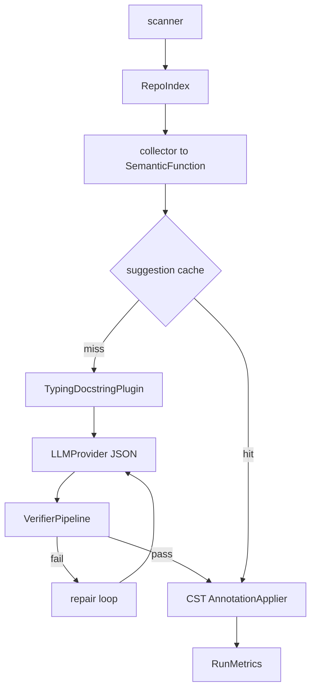

# LLM CST Refactorer — AI Semantic Transformation Engine

Format-preserving Python **semantic refactorer** that adds missing type hints and Google-style docstrings using [LibCST](https://libcst.readthedocs.io/) and an LLM — without destroying comments, spacing, or layout.

Licensed under **AGPL-3.0-or-later**.

> **Identity (v0.2):** not just an annotation inserter — a trustworthy semantic transformation engine for Python. Typing + docstrings are the first plugins on a shared `SemanticFunction` IR.

## Why LibCST?

Regex breaks syntax. `ast.unparse` drops formatting. **LibCST** keeps the concrete syntax tree intact and only mutates targeted nodes.

## Architecture



Pipeline stages: **index → collect IR → cache → plugin/LLM → multi-stage verify → CST apply → metrics/diff**.

## Features (v0.2)

- **SemanticFunction IR** — shared representation for plugins, prompts, cache, metrics
- **RepoIndex** — imports, neighbors, convention hints before prompting
- **Confidence + evidence** — structured JSON fields with `--min-confidence`
- **VerifierPipeline** — syntax → schema → mypy, with stage-tagged repair
- **Plugin API** — `RefactorPlugin` Protocol (`typing-docstring` default)
- **Suggestion cache** — `.llm_cst_cache/` (skip LLM, still verify)
- **RunMetrics** — wall time, LLM calls, cache hits, verify rate, `--report`
- **Dry-run by default** — Git-style colored diffs; `--apply` to write
- **Skip markers** — `# llm-cst: skip` / `# noqa: llm-cst`

## Install

Requires Python 3.11+.

```bash
git clone https://github.com/dranshrad/llm-cst-refactorer.git
cd llm-cst-refactorer
poetry install
poetry run llm-cst-refactor --help
```

## Quickstart

```bash
cp .env.example .env
# set ANTHROPIC_API_KEY or OPENAI_API_KEY

poetry run llm-cst-refactor examples/sample_legacy.py --engine anthropic
poetry run llm-cst-refactor examples/sample_legacy.py --engine anthropic --apply --report metrics.json
```

### Before / after (`examples/sample_legacy.py`)

**Before**

```python
def greet(name, times=1):
    # Preserve this comment when refactoring.
    return ("hello " + name + "! ") * times
```

**After (illustrative)**

```python
def greet(name: str, times: int = 1) -> str:
    """Return a repeated greeting.

    Args:
        name: Person to greet.
        times: Repetition count.
    """
    # Preserve this comment when refactoring.
    return ("hello " + name + "! ") * times
```

## Providers

| `--engine`   | Auth                | Notes |
|--------------|---------------------|-------|
| `anthropic`  | `ANTHROPIC_API_KEY` | Default model `claude-sonnet-4-20250514` |
| `openai`     | `OPENAI_API_KEY`    | Default model `gpt-4.1-mini` |
| `compatible` | `OPENAI_API_KEY`    | Requires `--base-url` (Ollama/vLLM/LocalAI) |

## CLI highlights

```text
llm-cst-refactor PATH
  --engine anthropic|openai|compatible
  --plugin typing-docstring
  --min-confidence 0.5
  --apply / --dry-run
  --no-cache / --refresh-cache
  --report metrics.json
  --types-only / --docs-only
  --force
```

## Plugins

Implement `RefactorPlugin` (`select` + `propose`) against `SemanticFunction` and register in `plugins/factory.py`. API version: **1**.

## Benchmarks

Offline oracle suite (CI-safe, no live LLM):

```bash
poetry run python -m benchmarks.run
```

Live-model evals: point the same corpus at a real provider locally (not run in CI).

## Safety

1. Dry-run default  
2. Multi-stage verification (syntax / schema / mypy)  
3. Confidence gate  
4. Skip comments  
5. Cache hits still re-verified before apply  

## Development

```bash
poetry install
poetry run ruff check src tests benchmarks
poetry run ruff format src tests benchmarks
poetry run mypy
poetry run pytest
poetry run python -m benchmarks.run
```

## Roadmap

- Call-graph / interprocedural reasoning
- Pyright verification stage
- Additional plugins (rename, complexity, security)
- Larger open-source precision corpora
- IDE / CI bot integrations

## License

[GNU Affero General Public License v3.0 or later](LICENSE). Network use of modified versions requires offering corresponding source.
