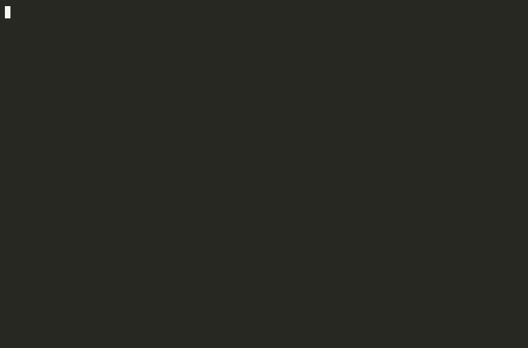
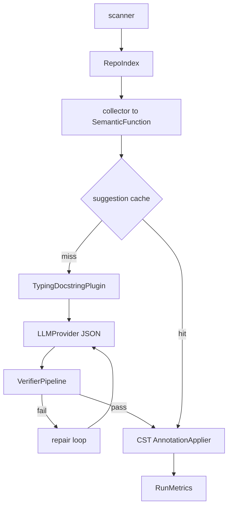

# LLM CST Refactorer — AI Semantic Transformation Engine

Format-preserving Python **semantic refactorer** that adds missing type hints and Google-style docstrings using [LibCST](https://libcst.readthedocs.io/) and an LLM — without destroying comments, spacing, or layout.

Licensed under **AGPL-3.0-or-later**.

> **Identity (v0.2):** not just an annotation inserter — a trustworthy semantic transformation engine for Python. Plugins share a `SemanticFunction` IR (`init-return-none` + `typing-docstring` by default).

## Why LibCST?

Regex breaks syntax. `ast.unparse` drops formatting. **LibCST** keeps the concrete syntax tree intact and only mutates targeted nodes.

## Architecture



Pipeline stages: **index → collect IR → cache → plugin/LLM → multi-stage verify → CST apply → metrics/diff**.

## Features (v0.2)

- **SemanticFunction IR** — shared representation for plugins, prompts, cache, metrics
- **RepoIndex** — imports, neighbors, convention hints before prompting
- **Confidence + evidence** — structured JSON fields with `--min-confidence`
- **VerifierPipeline** — syntax → schema → mypy, with stage-tagged repair
- **Plugin API** — `RefactorPlugin` Protocol (`init-return-none`, `typing-docstring`)
- **Suggestion cache** — `.llm_cst_cache/` (skip LLM, still verify)
- **RunMetrics** — wall time, LLM calls, cache hits, verify rate, `--report`
- **Dry-run by default** — Git-style colored diffs; `--apply` to write
- **Skip markers** — `# llm-cst: skip` / `# noqa: llm-cst`

## Install

Requires Python 3.11+.

```bash
git clone https://github.com/dranshrad/llm-cst-refactorer.git
cd llm-cst-refactorer
poetry install
poetry run llm-cst-refactor --help
```

## Demo

```bash
asciinema play docs/demo/dry-run-diff.cast
# golden unified diff: examples/captured/sample_legacy.unified.diff
# regenerate GIF: agg --speed 1.5 --font-size 14 --theme monokai docs/demo/dry-run-diff.cast docs/demo/dry-run-diff.gif
```

See [docs/demo/dry-run-diff.md](docs/demo/dry-run-diff.md).

## Quickstart

```bash
cp .env.example .env
# set ANTHROPIC_API_KEY or OPENAI_API_KEY

poetry run llm-cst-refactor examples/sample_legacy.py --engine anthropic
poetry run llm-cst-refactor examples/sample_legacy.py --engine anthropic --apply --report metrics.json
```

### Before / captured dry-run (`examples/sample_legacy.py`)

**Before**

```python
def greet(name, times=1):
    # Preserve this comment when refactoring.
    return ("hello " + name + "! ") * times
```

**Captured dry-run diff** (production pipeline: collect → plugins → verify → CST apply → unified diff). Generated offline with a deterministic CaptureProvider — same apply/verify path as a live LLM run. Regenerate with `poetry run python examples/generate_captured_diff.py`.

```diff
--- a/examples/sample_legacy.py
+++ b/examples/sample_legacy.py
@@ -2,21 +2,49 @@
 # Intentionally under-annotated / undocumented.
 
 
-def greet(name, times=1):
+def greet(name: str, times: int=1) -> str:
+    """Auto-documented `greet`.
+
+Args:
+    See parameters.
+
+Returns:
+    See return value."""
     # Preserve this comment when refactoring.
     return ("hello " + name + "! ") * times
 
 
 class Counter:
-    def __init__(self, start):
+    def __init__(self, start: int) -> None:
+        """Auto-documented `Counter.__init__`.
+
+Args:
+    See parameters.
+
+Returns:
+    See return value."""
         self.value = start
```

Full golden file: [`examples/captured/sample_legacy.unified.diff`](examples/captured/sample_legacy.unified.diff).

## Providers

| `--engine`   | Auth                | Notes |
|--------------|---------------------|-------|
| `anthropic`  | `ANTHROPIC_API_KEY` | Default model `claude-sonnet-5` |
| `openai`     | `OPENAI_API_KEY`    | Default model `gpt-5.6-luna` (use `gpt-5.6-terra` for harder files; `gpt-5.6` / `gpt-5.6-sol` for flagship) |
| `compatible` | `OPENAI_API_KEY`    | Requires `--base-url` (Ollama/vLLM/LocalAI) |

## CLI highlights

```text
llm-cst-refactor PATH
  --engine anthropic|openai|compatible
  --plugin init-return-none,typing-docstring
  --min-confidence 0.5
  --apply / --dry-run
  --no-cache / --refresh-cache
  --report metrics.json
  --types-only / --docs-only
  --force
```

## Plugins

| Plugin | Role |
|--------|------|
| `init-return-none` | Deterministic `-> None` on `__init__` (no LLM) |
| `typing-docstring` | LLM-backed param/return types + Google docstrings |

Default is both, comma-separated. Implement `RefactorPlugin` (`select` + `propose`) against `SemanticFunction` and register in `plugins/factory.py`. API version: **1**.

## Benchmarks

Offline oracle suite (CI-safe, no live LLM):

```bash
poetry run python -m benchmarks.run
```

Live-model evals: point the same corpus at a real provider locally (not run in CI).

## Safety

1. Dry-run default  
2. Multi-stage verification (syntax / schema / mypy)  
3. Confidence gate  
4. Skip comments  
5. Cache hits still re-verified before apply  

## Development

```bash
poetry install
poetry run ruff check src tests benchmarks
poetry run ruff format src tests benchmarks
poetry run mypy
poetry run pytest
poetry run python -m benchmarks.run
```

## Roadmap

- Call-graph / interprocedural reasoning
- Pyright verification stage
- Additional plugins (rename, complexity, security)
- Larger open-source precision corpora
- IDE / CI bot integrations

## License

[GNU Affero General Public License v3.0 or later](LICENSE). Network use of modified versions requires offering corresponding source. That is a deliberate copyleft choice for this suite — not an unexamined default.

## Related projects

| Project | Role |
|---|---|
| [codex-ast-mapper](https://github.com/dranshrad/codex-ast-mapper) | Compress repositories into token-budgeted LLM context |
| [llm-cst-refactorer](https://github.com/dranshrad/llm-cst-refactorer) | Format-preserving typing & docstring refactors |
| [automated-self-correction-loop](https://github.com/dranshrad/automated-self-correction-loop) (ASCL) | Execute → diagnose → heal loop |
| [voice-notes-to-anthropic-artifacts](https://github.com/dranshrad/voice-notes-to-anthropic-artifacts) | Local STT → Anthropic → `~/Artifacts` |
| [anthropic-audio-gateway](https://github.com/dranshrad/anthropic-audio-gateway) | Browser audio ↔ realtime provider adapters |
